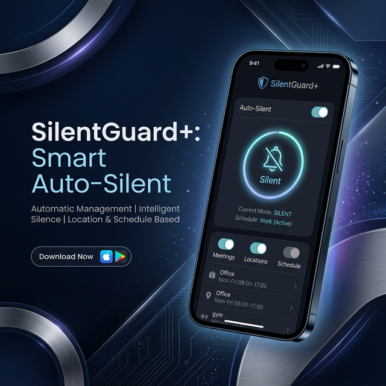

# 🛡️ SilentGuard+: The Professional Automation Suite
## *Mastering Device Silence with Computational Precision*

**SilentGuard+** is a high-performance, system-level automation utility engineered to eliminate the manual friction of ringer management. In a world of constant digital noise, SilentGuard+ serves as your personal acoustic gatekeeper—ensuring that your focus intervals, rest periods, and professional engagements are never interrupted by untimely notifications.



---

## 📘 Comprehensive Application Overview

SilentGuard+ is built on the philosophy of **"Set, Forget, and Focus."** While standard "Do Not Disturb" features on mobile operating systems offer basic scheduling, SilentGuard+ provides a deep, profile-driven logic engine that interfaces directly with the device's hardware layers. 

### Why SilentGuard+?
*   **Contextual Intelligence**: Your lifestyle isn't one-size-fits-all. Whether it's a recurring Monday-morning board meeting or a weekend nap, the app adapts to your specific temporal patterns.
*   **Hardware-Level Control**: We don't just "mute" the volume; we orchestrate the device's `AudioManager` state to ensure that vibration, silence, and normal modes are switched with deterministic reliability.
*   **Zero Battery Overhead**: The app is designed to be "invisible" to your battery. By utilizing system-level cyclic triggers instead of persistent background processes, it maintains peak performance without draining resources.
*   **Industrial Reliability**: Engineered to survive power cycles (reboots), low-memory states, and aggressive OS background task kills.

---

## ✨ Primary Feature Ecosystem

### 📅 Advanced Profile Management
The core of SilentGuard+ is its highly customizable profile system.
*   **Multi-State Support**: Choose between **Full Silent** (total hush), **Vibrate Only** (tactile alerts), and **Normal** (restoration).
*   **Temporal Precision**: Set exact start and end times down to the minute.
*   **Weekly Recurrence**: 
    *   *Professional Mode*: Auto-activates only on workdays (Mon-Fri).
    *   *Weekend Mode*: Specialized silence for your leisure time.
    *   *Daily Rituals*: For schedules that never change.
*   **Overnight Logic Handling**: Unlike basic schedulers, our engine handles "circular time" (e.g., a shift that starts at 10:00 PM and ends at 6:00 AM next day).

### 🔔 Intelligent Awareness & Feedback
*   **Active Guard Status**: A real-time dashboard on the Home screen tells you exactly which profile is in control.
*   **Non-Intrusive Notifications**: Subtle system alerts keep you informed when your phone enters or exits a silent zone.
*   **Visual Continuity**: A Material 3 interface that dynamically adjusts to your system's Light or Dark theme.

### 📜 Digital Audit Trails (History)
Every automated action is logged for your review.
*   **Activation Logs**: Records the exact second a profile took control.
*   **Deactivation Logs**: Documents when your phone was restored to its normal state.
*   **Diagnostic Insights**: If a profile fails to trigger (e.g., due to missing permissions), it is logged here so you can fix it.

---

## ⚙️ How It Works (The Engineering Logic)

SilentGuard+ operates through a multi-layered synchronization process:

### 1. The Interaction Layer (Flutter UI)
*   **State Management**: Uses the **Provider** pattern to ensure that the moment you toggle a switch, every screen in the app updates instantly.
*   **Input Validation**: Our logic prevents overlapping time ranges and invalid day selections before they are even saved.

### 2. The Persistence Layer (Local Storage)
*   **Storage Utility**: Uses high-speed local preferences to store your profiles.
*   **JSON Serialization**: Profiles are converted into structured data that is easy for the background engine to read quickly.
*   **Privacy Guard**: No data ever leaves your device. Your schedule is your business.

### 3. The Execution Layer (Background Guard)
*   **Workmanager Engine**: Every 15 minutes, the OS gives SilentGuard+ a small "heartbeat" to check the current time.
*   **Decision Matrix**: 
    1.  *Is Today a selected day?*
    2.  *Is the Current Time within the Start/End window?*
    3.  *Is the App enabled?*
*   **Platform Channels**: The app sends a "Pulse" to the native Android/iOS system to flip the hardware sound switch.

---

## 🏗️ Technical Specifications

### 🛠️ The Tech Stack
*   **Core Framework**: Flutter (Stable Channel)
*   **System Schedulers**: Workmanager (Native Integration)
*   **UI Components**: Material 3 (Latest Design Tokens)
*   **Typography**: Google Fonts (Inter & Outfit)
*   **Icons**: Material Icons Rounded

### 📱 System Requirements
*   **Android Support**: Lollipop (5.0) to Android 15 (Exclusive Support)
*   **iOS Support**: iOS 12.0 and above
*   **Permissions**: 
    *   *DND Management*: To control the system silence state.
    *   *Boot Receiver*: To start the guard after your phone turns on.
    *   *Notification Access*: To show transition alerts.

---

## 🔮 Future Roadmap (Release v2.0 - v4.0)

We are constantly pushing the boundaries of what a focus app can do:
*   **📍 Location Triggers**: Automatically silent your phone when you walk into your office or library using Geofencing.
*   **📡 Network Sentry**: Toggle profiles based on which WiFi network you are connected to (e.g., silent when on "Starbucks_WiFi").
*   **🗓️ Calendar Pulse**: Direct sync with Google and Apple Calendars to auto-silent during meetings with "Busy" status.
*   **🤖 Smart Reply**: Integrates with SMS (where permitted) to auto-reply to callers that you are currently in a focus session.

---

## 📂 Project Architecture Overview

```text
lib/
├── core/
│   ├── services/    # Engines for BackgroundTasks, SoundControl, etc.
│   ├── theme/       # Design System (Colors, DarkMode, Typography)
│   └── utils/       # Mathematical logic for Time and Date calculations
├── models/          # Data Schemas (How we define a 'Profile')
├── providers/       # The 'Connectors' between logic and UI
├── screens/         # User Interface Modules (Home, Settings, History)
└── widgets/         # Premium UI Elements (Custom Cards, Sliders)
```

---

## 🏁 Getting Started for Developers

1.  **Repository Sync**: `git clone https://github.com/priyamibagohil/SilentGuard-.git`
2.  **Asset Bootstrap**: `flutter pub get`
3.  **DND Calibration**: On physical devices, you MUST grant **Do Not Disturb Access** in the phone's security settings for the app to function.
4.  **Deployment**: `flutter run --release` (Recommended for testing background triggers).

---

Developed with ❤️ and Engineering Excellence by **Priyamiba gohil**.  
*Focused Technology for Focused People.*


